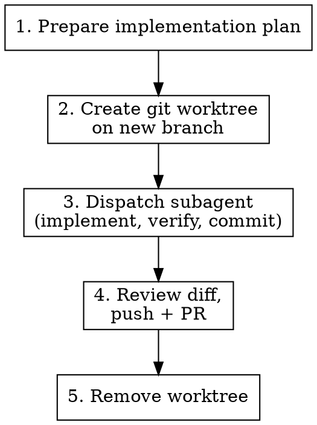

# Dispatch Worktree Task

## Overview

Packages a task with a clear plan, creates an isolated git worktree, and dispatches a subagent to implement, validate, verify, and commit in the background. The main session reviews, pushes, and creates the PR.

**Core principle:** Plan in the main session, execute in isolation, verify before pushing.

## When to Use

- Implementation plan is written and approved
- Task is self-contained (no back-and-forth needed)
- You want background execution while continuing other work

**When NOT to use:**
- Task requires interactive clarification mid-implementation
- Changes span multiple repos or need coordination with other branches
- Quick single-file fix (just do it inline)

## Workflow



### 1. Prepare the implementation plan

Write a detailed plan that includes:
- **Context** — why this change, what was tried/rejected
- **Step-by-step plan** — numbered, specific files and code patterns
- **Pre-commit validation** — exact commands to run (read from project's CLAUDE.md)
- **Reproduction command** — a command that exercises the original scenario (bug or feature). Adapt paths, use temp dirs, etc., but exercise the same behavior. The subagent must run it after implementing and confirm the fix works.
- **What NOT to do** — anti-patterns to avoid

### 1b. Verify plan completeness

Before proceeding, confirm the plan includes all required sections:

- [ ] **Context** — why this change, what was tried/rejected
- [ ] **Step-by-step plan** — numbered, specific files and code patterns
- [ ] **Pre-commit validation** — exact commands from project's CLAUDE.md
- [ ] **Reproduction command** — a command that exercises the original scenario. For refactorings or structural changes where there's no behavioral scenario, reproduction = "existing tests pass and restructured code compiles" — state this explicitly rather than omitting reproduction.
- [ ] **Anti-patterns** — what NOT to do

If any section is missing or vague, fill it in before creating the worktree.

### 2. Create worktree

```bash
git worktree add .worktrees/<branch-name> -b <branch-name> main
```

Use `.worktrees/` directory. Check that `.worktrees/` is in `.gitignore`. If not, add it before creating the worktree. Branch name should match the work (e.g., `fix/cache-lock-fs4`).

> **Stale worktree/branch:** If the branch or worktree already exists from a previous attempt, remove them first (`git worktree remove .worktrees/<branch-name>` and `git branch -D <branch-name>`) or reuse after verifying the worktree state is clean (`git status` in the worktree).

> **Why manual worktrees instead of `isolation: "worktree"`?** The branch is the deliverable — it gets pushed and PR'd. You need a named branch you control. For fan-out/fan-in where you cherry-pick temporary commits back, see `review-and-fix`.

### 3. Dispatch subagent

Use the Agent tool with these settings:

| Parameter | Value |
|-----------|-------|
| `subagent_type` | `general-purpose` |
| `mode` | `bypassPermissions` |
| `run_in_background` | `true` |

> **Risk note:** Unlike `isolation: "worktree"` (which physically starts the agent in a separate directory), `bypassPermissions` here applies while the agent is still in the parent's working directory. The `cd` instruction below is critical — without it, the agent operates on the main tree with no permission prompts. Always make `cd` the first instruction in the prompt and never place other commands before it.

**Prompt must include:**
- Worktree path and branch name
- **Explicit `cd <worktree-absolute-path>` as the subagent's FIRST action — before any other command.** The Agent tool starts subagents in the parent's working directory, not the worktree.
- Full implementation plan
- Pre-commit validation commands (from project CLAUDE.md)
- **Reproduction command** — a command that exercises the same scenario as the original report. Adapt for the worktree context (temp output dirs, etc.) but verify the same behavior.
- Commit message to use (conventional commits)
- Project conventions (no co-authored-by lines, etc.)

**Subagent execution order:**
1. Implement the change
2. Run pre-commit validation (from project CLAUDE.md)
3. **Reproduce the original scenario** — build and run a command that exercises the same behavior from the original report. Adapt for safety (temp dirs, non-destructive variants) but verify the same scenario.
4. Commit (do NOT push — the main session handles push after review)

**On failure:** If the implementation is incomplete, the plan doesn't match reality, or validation/reproduction fails — the subagent must NOT commit. Instead, report what happened: what was attempted, what failed, and what state the worktree is in. The main session will decide next steps.

If reproduction fails but the fix is otherwise correct, the subagent should fix the issue and re-verify. If it cannot fix it, do not commit — report the failure.

### 4. Review, push, and create PR

When the agent reports back:
- Show `git log main..<branch> --oneline` and `git diff --stat main..<branch>`
- Read the actual diff for the files listed in the implementation plan
- Confirm the reproduction command passed in the agent's output
- Push the branch: `git push -u origin <branch>`
- Create the PR (or remind the user)

### 5. Clean up worktree

After the PR is created, remove the worktree:

```bash
git worktree remove .worktrees/<branch-name>
```

## Common Mistakes

| Mistake | Fix |
|---------|-----|
| No reproduction command in prompt | Always include a command that exercises the original scenario |
| Reproduction command is just "run tests" | Tests verify correctness; reproduction verifies the original complaint is resolved |
| Reproduction command is destructive | Adapt for safety — use temp dirs, non-destructive variants — but verify the same behavior |
| Vague subagent prompt | Paste the full plan — subagents have no prior context |
| Not verifying the diff | Always read the key file diffs before creating the PR |
| Skipping pre-commit in prompt | Agent won't know to run validation unless told |
| Forgetting the PR | Always create or remind about PR after reviewing |
